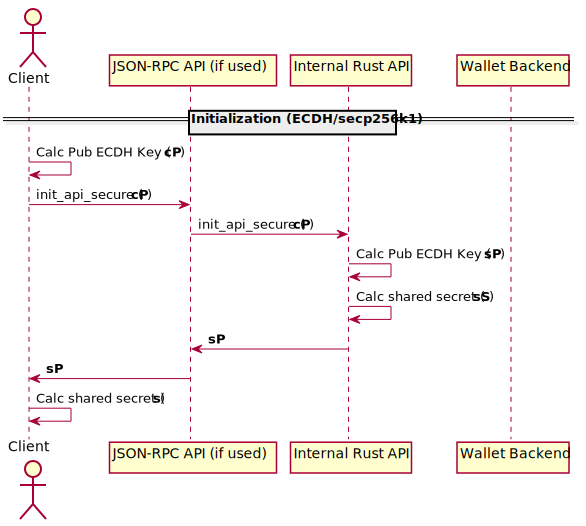
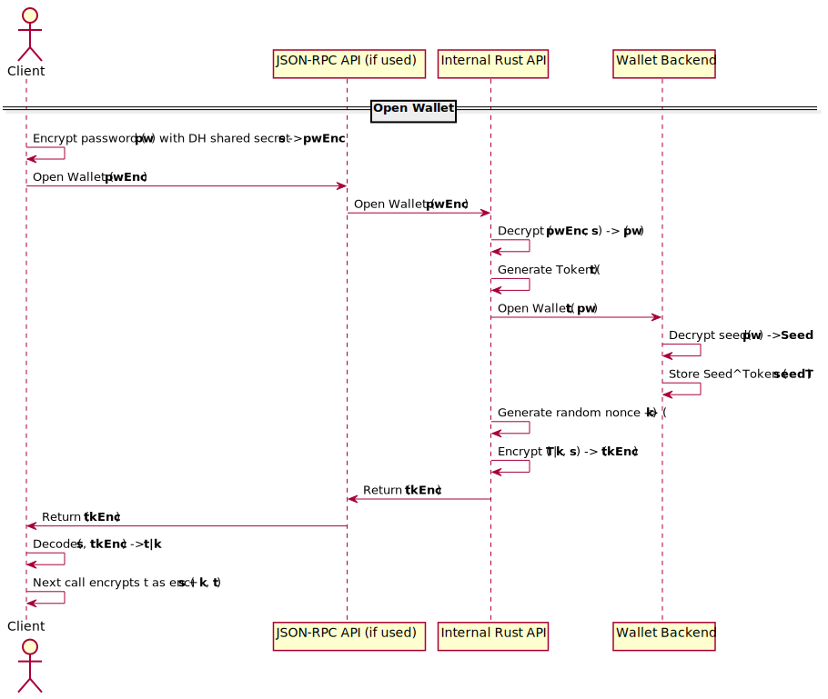
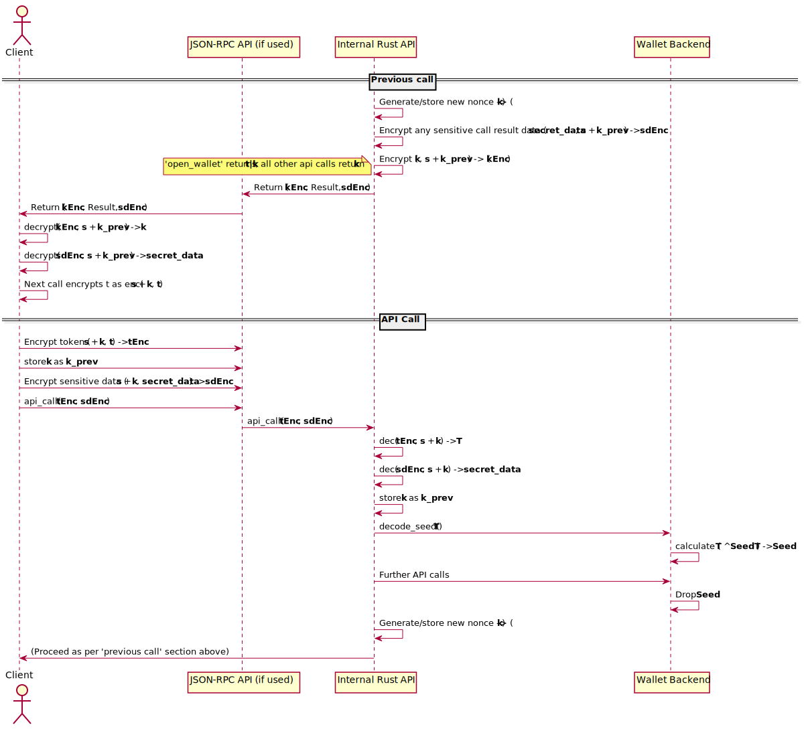

- Title: full-wallet-lifecycle
- Authors: [Michael Cordner](mailto:yeastplume@protonmail.com)
- Start date : June 26th, 2019
- RFC PR: Edit if merged: [mimblewimble/grin-rfcs#0000](https://github.com/mimblewimble/grin-rfcs/pull/0000) 
- Tracking issue: [Edit if merged with link to tracking github issue]

---

# Summary
[summary]: #summary

Increase the scope of the Grin Wallet's Owner API to support full wallet lifecycle functions.

# Motivation
[motivation]: #motivation

Grin Wallet's APIs currently provides functions for transacting and querying the contents of the wallet. However, several pieces of functionality
around wallet creation and seed/password management are not included within the API. This means that any consumers of the API will either expect their users
to initialize the wallet manually before the APIs can be used, or provide custom management for wallet lifecycle functions.

The Wallet APIs are intended to be the foundation upon which community-created wallets should be built, and the job of a wallet creator is made far
more difficult by the absence of wallet creation and seed management functions within the API. Ideally, it should be the case that a wallet can
be instantiated and managed solely via the Owner API.

# Community-level explanation
[community-level-explanation]: #community-level-explanation

From an end-user perspective, (i.e. end-users of community wallets that use the wallet API,) this change should be transparent.

# Reference-level explanation
[reference-level-explanation]: #reference-level-explanation

## Wallet Initialization

Currently, wallet data does not exist until the user runs `grin-wallet init`. The `init` command creates `grin-wallet.toml`,
in the `~/.grin/main` directory (or `~/.grin/floonet`, or the current directory via the `-h` flag), prompts the user for a password,
creates a seed file, stores the resulting data files in the directory specified in `grin-wallet.toml` (`~/.grin/main/wallet_data` by default)
and initialises the lmdb database.

It should be possible to run `grin-wallet owner_api` or invoke the API directly from a linked binary without having instantiated a wallet.

## Security Model

Given that the Wallet's Owner API needs to deal with sensitive data such as passwords and seed phrases, the API will be enhanced with a new ECDH and Token-based security model, the primary goals of which are to:

* Ensure sensitive data such as passwords or seed phrases are always end-to-end encrypted between the client and Owner API server, regardless of what higher-level protocols are used during the exchange.
* Minimize the potential for damage that can be done by a third party listening on the exchange between a wallet client and its corresponding server.
* Ensure that sensitive data such as passwords or seed phrases are not resident in server-side memory any longer than they absolutely need to be.

Note that this mode of operation is primarly intended for use over the JSON-RPC API, which supports many different architectural possiblities. Clients that link libraries directly and keep all sensitive data in the same process would see less benefit from this scheme, and an alternative model which doesn't encrypt any sensitive data is provided. Further, authors of existing wallets will need time to consider and/or implement the added complexity needed on the client-side to support ECDH and encryption. It's therefore proposed that the Owner API initially provide the new "SecureAPI" mode as an optional feature, with wallet authors strongly encouraged to make use of it. Support for the "InsecureAPI" model can be maintained indefinitely for directly-linked wallets, and for the JSON-RPC API until a cut-off release at some point in the future.

### SecureAPI Mode

SecureAPI Mode consists of an ECDH key agreement followed by the establishment of an API Token that's used to XOR encrypt the wallet seed on the server side. The negotiated ECDH shared key is used to encrypt the initial password used during the first call to the `open_wallet` API function, which generates and returns a token to the client to be supplied during all subsequent API calls. The token is encrypted using a scheme whereby a new random nonce is generated during each API call, which both client and server will add to the original shared key for use in the next API call. This ensures that each instance of an encrypted Token passed in by the client is single-use, and a snooping attacker can not reuse an encrypted token.

Q: Exact encryption parameters TBD

### Security Mode Selection

To initialize SecureAPI Mode, clients will generate an EC keypair using the secp256k1 curve, and provide the public key to the Owner API server via a new `init_api_secure` method. Both client and server will calculate the shared key, and store this key for the remainder of the session. The sequence of operations is outlined below:

Any wallets opened by the API will be closed on a call to `init_api_secure`. Once `init_api_secure` is called the API will assume that the next call to `open_wallet` will contain an encrypted password, and that that all subsequent API calls will be accompanied with a valid encrypted token derived during the call to the `open_wallet` function. This assumption will remain until the server process exits or a call to a corresponding `close_api_secure` function is called.

The shared secret can be refreshed by the client at any time with another call to `init_api_secure`. Closing a wallet via the `close_wallet` function does not regenerate the shared secret.

### Opening a Wallet

Opening a wallet in SecureAPI mode consists of encrypting the password with the original shared secret `s` and providing it to the `open_wallet` api function. The decrypted password is used on the server-side to unlock the wallet master seed, which is stored XORed against a randomly-generated token T. T is then returned to the client for use in further API calls alongside another randomly generated "next nonce" k, to be used in encryption of T during the next call:

### Calling API functions in SecureAPI mode

Each call to the API function encrypts the token T with the DH-derived shared secret key added to a random nonce generated by the server during the previous API call. The token is XORed against the stored XORed seed to recover the original seed for each call, and the seed value is dropped and zeroed from memory when each API call returns.

## New API Functions

(Needs updating)

* `OwnerAPI::set_wallet_directory(dir: String) -> Result<(), libwallet::Error>`
    - On API startup, it's assumed the top-level wallet data directory is `~/.grin/main/wallet_data` (or floonet equivalent)
    - Set the top-level system wallet directory from which named wallets are read. Further calls to lifecycle functions will use this wallet directory
* `OwnerAPI::create_config(data_dir: Option<String>, config_overrides: Option<GlobalWalletConfig>) -> Result<(), libwallet::Error>`
    - Outputs a `grin-wallet.toml` file into current top-level system wallet directory
    - Optionally takes wallet configuration structure to override defaults in the grin-wallet.toml file
* `OwnerAPI::open_wallet(name: Option<String>, password: String) -> Result<(), libwallet::Error>`
    - Opens the wallet and sets it as the 'active' wallet. All further API commands will be performed against this wallet.
    - The 'name' argument is included for future use, anticipating the inclusion of multiple wallets and seeds within a single top-level wallet directory.
* `OwnerAPI::create_wallet(name: Option<String>, mnemonic: String, password: String) -> Result<(), libwallet::Error>`
    - Creates and initializes a new wallet
    - Initializes seed from given mnemonic if given, random seed otherwise
    - Should error appropriately if the wallet already exists
    - The 'name' parameter is included for future use as in `open_wallet` above.
* `OwnerAPI::get_mnemonic() -> Result<String, libwallet::Error>`
    - Returns the mnemonic from the active, (open) wallet
* `OwnerAPI::change_password(old: String, new: String) -> Result<(), libwallet::Error>`
    - Changes the password for the open wallet. This will essentially:
        - Close the wallet instance
        - Confirm the existing seed can be opened with the given password
        - Regenerate the `wallet.seed` file with the new password
        - Re-open the wallet instance
        - (Should this just operate on closed wallets instead?)
* `OwnerAPI::delete_wallet(name: Option<String>, password: String) -> Result<(), libwallet::Error>`
    - Dangerous function that removes all wallet data
    - name argument reserved for future use

### Use cases

* First time use (API Case)
   - run `grin-wallet owner_api`
   - top-level data directory is set to `~/.grin/main/wallet_data` (but nothing is yet written)
   - `create_config` called to create `grin-wallet.toml`
   - `create_wallet` called (with name == None) and seed to create a new wallet and seed, wallet data is created and initialized

* Recover from seed
   - As above, except call `create_wallet` with mnemonic seed instead

### API only

Note that this RFC does not propose making user-facing changes to the existing CLI wallet to invoke these functions. It's expected that the existing cli functionality will be modified to invoke the new API functions.

### Implementation notes

Although this document doesn't attempt to outline implementation, a few notes to consider for the implementor:

* Currently, the code that deals with wallet initialization and seed management sits outside the wallet APIs, in the `impls` crate, (denoting they're implementation specific). The implementation should attempt to refactor traits from these hard implementations into a new interface, similar to the existing WalletBackend and NodeClient interfaces (WalletLifecycleManager, for instance). The implementation within `impls` will then become an implementation of that trait, and can be substituted by wallet authors with their own implementations.
* The implementation period of this RFC may be a good time to remove the BIP32 specific code out from Grin core into the wallet or into a separate rust crate (probably more desirable).
* New API functions should be implemented as additions, with the new features optional to ensure complete backwards compatibility

# Drawbacks
[drawbacks]: #drawbacks

* Sending sensitive information such as passwords and mnemonics via the OwnerAPI is an obvious security concern.

# Rationale and alternatives
[rationale-and-alternatives]: #rationale-and-alternatives

TBD

# Prior art
[prior-art]: #prior-art

TBD

# Unresolved questions
[unresolved-questions]: #unresolved-questions

* Security implications of sending passwords and/or master seed mnemonics through the JSON-RPC API, and how to deal with this as securely as possible.
* Security implications of leaving master seed 'open' in memory (this is aleady a concern for most wallets, but there isn't a clear way to deal with this).
* Should upgrade mechanism to support multiple wallets just leave the default directory in place, to minimise the impact of disruption?

# Future possibilities
[future-possibilities]: #future-possibilities

The changes in this RFC lead the way for:

* Support for multiple wallets in a single top-level data directory
* An alternate method of command-line invocation whereby the wallet presents its own prompt instead of using single-use commands.

# References
[references]: #references

None

